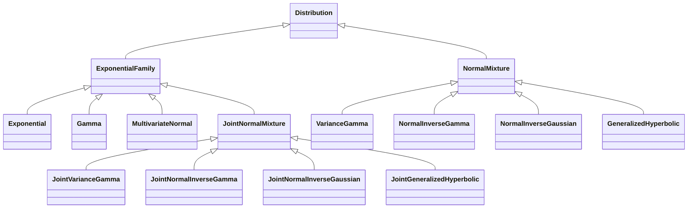
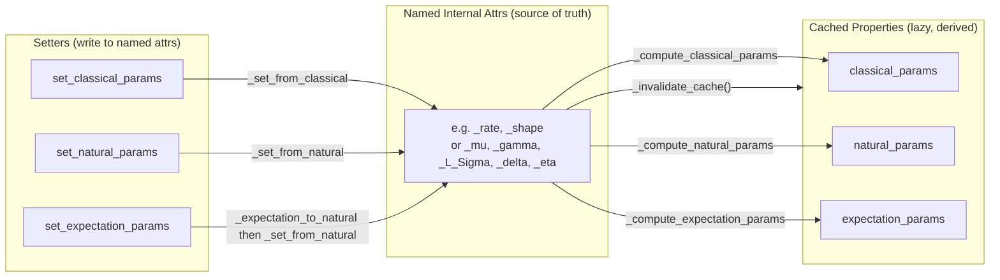

# Redesign Parameter Storage Architecture

## Guiding Principles

1. **Named attributes are the single source of truth** -- no `_natural_params` tuple.
2. **Cached properties are lazy** -- `natural_params`, `classical_params`, `expectation_params` are computed on demand from internal state, never stored eagerly.
3. **Setter paths are independent** -- `_set_from_classical` and `_set_from_natural` each write directly to named attributes; they never call each other.
4. **EM has a zero-overhead fast path** -- `_set_internal()` writes pre-computed values (e.g., `L_Sigma`) without any decomposition.
5. **Cholesky everywhere** -- all linear algebra on covariance/precision matrices uses Cholesky factors (`solve_triangular`, `cho_solve`) instead of `np.linalg.inv` / `np.linalg.slogdet`.

## Class Hierarchy (unchanged)



---

## Layer 1: ExponentialFamily

`ExponentialFamily` defines the protocol but has **no named parameter attributes** of its own.

### Internal state

- Remove `_natural_params = None` from `__init__`. No parameter storage at this level.

### Public API (user-facing)

- `from_classical_params(**kw)` -- classmethod factory, calls `set_classical_params`
- `from_natural_params(theta)` -- classmethod factory, calls `set_natural_params`
- `from_expectation_params(eta)` -- classmethod factory, calls `set_expectation_params`
- `set_classical_params(**kw)` -- calls `_set_from_classical(**kw)`, returns self
- `set_natural_params(theta)` -- calls `_set_from_natural(theta)`, returns self
- `set_expectation_params(eta)` -- default: `_expectation_to_natural(eta)` then `_set_from_natural(theta)`, returns self
- `classical_params` -- cached_property, calls `_compute_classical_params()`
- `natural_params` -- cached_property, calls `_compute_natural_params()`
- `expectation_params` -- cached_property, calls `_compute_expectation_params()`
- `logpdf(x)` -- default: `log h(x) + theta^T t(x) - psi(theta)` using `natural_params`
- `pdf(x)` -- `exp(logpdf(x))`
- `fit(X)` -- MLE via sufficient statistics mean -> `set_expectation_params`
- `fisher_information(theta)` -- Hessian of log partition (numerical default)

### Subclass contract (protected methods)

**Required -- every child must implement:**

- `_set_from_classical(**kw)` -- parse classical params, store as named attrs, set `_fitted=True`, call `_invalidate_cache()`
- `_set_from_natural(theta)` -- decompose theta into named attrs, store, set `_fitted=True`, call `_invalidate_cache()`
- `_compute_natural_params() -> NDArray` -- build flat theta from named attrs (backs `natural_params`)
- `_compute_classical_params() -> dataclass` -- build frozen dataclass from named attrs (backs `classical_params`)
- `_sufficient_statistics(x)` -- compute t(x)
- `_log_partition(theta)` -- compute psi(theta)
- `_log_base_measure(x)` -- compute log h(x)
- `_get_natural_param_support()` -- bounds for theta validation

**Optional -- override for efficiency:**

- `_compute_expectation_params()` -- default: calls `_natural_to_expectation(self.natural_params)`
- `_natural_to_expectation(theta)` -- default: numerical gradient of `_log_partition`
- `_expectation_to_natural(eta)` -- default: L-BFGS-B optimization
- `logpdf(x)` -- default: uses exp family form via `natural_params`

### Data flow diagram



Key point: the three setter paths are **independent**. `_set_from_classical` never calls `_classical_to_natural` then `_set_from_natural`. It writes directly to named attrs.

### Example: Gamma (simple, already close to target)

```python
class Gamma(ExponentialFamily):
    def __init__(self):
        super().__init__()
        self._shape = None
        self._rate = None

    def _set_from_classical(self, *, shape, rate):
        self._shape = float(shape)
        self._rate = float(rate)
        self._fitted = True
        self._invalidate_cache()

    def _set_from_natural(self, theta):
        self._validate_natural_params(theta)
        self._shape = float(theta[0] + 1)
        self._rate = float(-theta[1])
        self._fitted = True
        self._invalidate_cache()

    def _compute_natural_params(self):
        return np.array([self._shape - 1, -self._rate])

    def _compute_classical_params(self):
        return GammaParams(shape=self._shape, rate=self._rate)
```

---

## Layer 1.5: MultivariateNormal -- Cholesky simplification

`normix/distributions/multivariate/normal.py` already stores `_mu` and `_L` (Cholesky of Sigma) and overrides `logpdf` with Cholesky-based computation. However, several methods still use `np.linalg.inv` and `np.linalg.slogdet` instead of Cholesky. These should be rewritten:

### `_log_partition(theta)` -- currently uses `np.linalg.inv(Lambda)` and `np.linalg.slogdet`

Replace with Cholesky of Lambda:

```python
def _log_partition(self, theta):
    d = self.d
    eta = theta[:d]
    Lambda_half = theta[d:].reshape(d, d)
    Lambda = -2 * Lambda_half

    L_Lambda = cholesky(Lambda, lower=True)
    log_det_Lambda = 2.0 * np.sum(np.log(np.diag(L_Lambda)))

    # mu = Lambda^{-1} @ eta via cho_solve
    mu = cho_solve((L_Lambda, True), eta)

    # psi = 1/2 eta^T mu - 1/2 log|Lambda| + d/2 log(2pi)
    psi = 0.5 * eta @ mu - 0.5 * log_det_Lambda + 0.5 * d * np.log(2 * np.pi)
    return float(psi)
```

### `_natural_to_expectation(theta)` -- currently uses `np.linalg.inv(Lambda)`

Replace with Cholesky:

```python
def _natural_to_expectation(self, theta):
    d = self.d
    eta = theta[:d]
    Lambda_half = theta[d:].reshape(d, d)
    Lambda = -2 * Lambda_half

    L_Lambda = cholesky(Lambda, lower=True)
    mu = cho_solve((L_Lambda, True), eta)

    # Sigma = Lambda^{-1} via L_Lambda
    L_inv = solve_triangular(L_Lambda, np.eye(d), lower=True)
    Sigma = L_inv.T @ L_inv

    eta1 = mu
    eta2 = (Sigma + np.outer(mu, mu)).flatten()
    return np.concatenate([eta1, eta2])
```

### `_expectation_to_natural(eta)` -- currently uses `np.linalg.inv(Sigma)`

Replace with Cholesky:

```python
def _expectation_to_natural(self, eta, theta0=None):
    # ... dimension inference ...
    mu = eta[:d]
    Sigma = eta[d:].reshape(d, d) - np.outer(mu, mu)

    L = robust_cholesky(Sigma, eps=1e-6)
    Sigma = L @ L.T

    # Lambda = Sigma^{-1} via Cholesky
    eta_nat = cho_solve((L, True), mu)       # Lambda @ mu
    L_inv = solve_triangular(L, np.eye(d), lower=True)
    Lambda = L_inv.T @ L_inv
    Lambda_half = -0.5 * Lambda
    return np.concatenate([eta_nat, Lambda_half.flatten()])
```

### `_set_from_classical` -- remove redundant Lambda computation

Currently computes Lambda and stores `_natural_params` tuple. Remove the Lambda computation and `_natural_params` line entirely:

```python
def _set_from_classical(self, *, mu, sigma):
    mu = np.asarray(mu).flatten().astype(float)
    sigma = np.asarray(sigma, dtype=float)
    # ... validation ...
    self._d = len(mu)
    self._mu = mu.copy()
    self._L = cholesky(sigma, lower=True)
    # NO Lambda computation, NO _natural_params storage
    self._fitted = True
    self._invalidate_cache()
```

### `_set_from_natural` -- remove `_natural_params` tuple storage

Remove line `self._natural_params = tuple(theta)`.

### Same pattern applies to JointNormalMixture logpdf

The default `ExponentialFamily.logpdf` calls `_log_partition(self.natural_params)` which already uses Cholesky via `_extract_normal_params_with_cholesky`. This is acceptable for Joint classes since the joint `logpdf` is rarely called directly. No override needed.

For **marginal** `_marginal_logpdf` in NIG, VG, NInvG, GH: these already use Cholesky efficiently via `L_inv = self._joint.L_Sigma_inv`. No changes needed -- but they currently access mixing params via `self._joint.classical_params` (triggering full conversion). See "Marginal direct attribute access" below.

---

## Layer 2: JointNormalMixture

### Internal state

- `_mu` -- location vector (d,)
- `_gamma` -- skewness vector (d,)
- `_L_Sigma` -- lower Cholesky of Sigma (d, d) -- canonical form
- *(subclass-specific mixing params)* -- see Layer 3

Remove: `_natural_params = None` (no longer stored at this level).

### Methods at this level

**`_store_normal_params`** -- shared helper:

```python
def _store_normal_params(self, *, mu, gamma, sigma):
    mu = np.asarray(mu).flatten()
    gamma = np.asarray(gamma).flatten()
    Sigma = np.asarray(sigma)
    self._d = len(mu)
    self._mu = mu
    self._gamma = gamma
    self._L_Sigma = robust_cholesky(Sigma)
```

**`_set_from_natural`** -- at JointNormalMixture level, delegates mixing to subclass:

```python
def _set_from_natural(self, theta):
    theta = np.asarray(theta, dtype=float)
    self._validate_natural_params(theta)
    L_Lambda, _, mu, gamma, Sigma = self._extract_normal_params_with_cholesky(
        theta, return_sigma=True
    )
    self._mu = mu
    self._gamma = gamma
    self._L_Sigma = robust_cholesky(Sigma)
    self._store_mixing_params_from_theta(theta)
    self._fitted = True
    self._invalidate_cache()
```

**`_set_internal`** -- EM fast path, zero decompositions:

```python
def _set_internal(self, *, mu, gamma, L_sigma, **mixing_kwargs):
    self._mu = np.asarray(mu).flatten()
    self._gamma = np.asarray(gamma).flatten()
    self._L_Sigma = np.asarray(L_sigma)
    self._d = len(self._mu)
    self._store_mixing_params(**mixing_kwargs)
    self._fitted = True
    self._invalidate_cache()
```

**`_compute_natural_params`** -- builds theta from named attrs using `cho_solve`:

```python
def _compute_natural_params(self):
    d = self._d
    theta_5 = cho_solve((self._L_Sigma, True), self._mu)
    theta_4 = cho_solve((self._L_Sigma, True), self._gamma)
    L_inv = solve_triangular(self._L_Sigma, np.eye(d), lower=True)
    Lambda = L_inv.T @ L_inv
    theta_6 = -0.5 * Lambda
    theta_1, theta_2, theta_3 = self._compute_mixing_theta(theta_4, theta_5)
    return np.concatenate([[theta_1, theta_2, theta_3], theta_4, theta_5, theta_6.flatten()])
```

### `_create_mixing_distribution` -- new method to replace `_get_mixing_natural_params`

Instead of extracting mixing natural params from theta to construct a mixing distribution, subclasses implement `_create_mixing_distribution()` that builds it directly from named attributes:

```python
# In JointNormalMixture:
@abstractmethod
def _create_mixing_distribution(self) -> ExponentialFamily:
    """Create the mixing distribution from named internal attributes."""
    pass

# In JointNormalInverseGaussian:
def _create_mixing_distribution(self):
    return InverseGaussian.from_classical_params(delta=self._delta, eta=self._eta)
```

Then `rvs`, `mean`, `cov` use `self._create_mixing_distribution()` directly -- no theta computation needed.

### New abstract methods for subclasses

- `_store_mixing_params(**kw)` -- store mixing params from kwargs (e.g., `delta`, `eta`)
- `_store_mixing_params_from_theta(theta)` -- extract and store mixing params from natural param vector
- `_compute_mixing_theta(theta_4, theta_5) -> (t1, t2, t3)` -- build theta_1, theta_2, theta_3 from mixing params and quadratic forms
- `_create_mixing_distribution() -> ExponentialFamily` -- construct mixing dist from named attrs

---

## Layer 3: Concrete Joint Subclasses

Each adds its own mixing parameter attributes:

- JointVarianceGamma: `_shape`, `_rate`
- JointNormalInverseGamma: `_shape`, `_rate`
- JointNormalInverseGaussian: `_delta`, `_eta`
- JointGeneralizedHyperbolic: `_p`, `_a`, `_b`

Each implements:

- `_set_from_classical(**kw)`: calls `_store_normal_params(...)` then `_store_mixing_params(...)`, sets `_fitted`, invalidates cache
- `_compute_classical_params()`: builds frozen dataclass from named attrs
- `_store_mixing_params(**kw)`: stores named mixing attrs
- `_store_mixing_params_from_theta(theta)`: extracts mixing params from theta using quadratic forms
- `_compute_mixing_theta(theta_4, theta_5)`: builds theta_1, theta_2, theta_3
- `_create_mixing_distribution()`: builds mixing dist from named attrs

---

## Layer 4: NormalMixture (marginal) -- direct attribute access

**No changes to the delegation pattern.** `NormalMixture` owns `_joint: JointNormalMixture` and forwards all parameter operations.

### Marginal direct attribute access

Currently `_marginal_logpdf` and `_conditional_expectation_y_given_x` access mixing params via:

```python
classical = self._joint.classical_params  # triggers full _natural_to_classical!
delta = classical['delta']
eta = classical['eta']
```

Change to direct attribute access:

```python
delta = self._joint._delta
eta = self._joint._eta
```

This eliminates a full `_compute_classical_params` call on every `logpdf` evaluation.

Similarly, `mixing_distribution` property in `NormalMixture` (line 1448 of `normix/base/mixture.py`) currently computes `natural_params` just to pass them through `_get_mixing_natural_params`. Change to:

```python
@property
def mixing_distribution(self):
    return self.joint._create_mixing_distribution()
```

### EM M-step update

Changes from:

```python
# OLD (3 Cholesky + 2 inversions per iteration):
L = robust_cholesky(Sigma_new)
Sigma_new = L @ L.T
self.set_classical_params(mu=mu_new, gamma=gamma_new, sigma=Sigma_new, delta=..., eta=...)
```

to:

```python
# NEW (1 Cholesky, stored directly):
L_Sigma = robust_cholesky(Sigma_new)
self._joint._set_internal(
    mu=mu_new, gamma=gamma_new, L_sigma=L_Sigma,
    delta=delta_new, eta=eta_new
)
self._fitted = True
self._invalidate_cache()
```

---

## Methods to REMOVE (redundant)

### In `JointNormalMixture` (`normix/base/mixture.py`):

1. **`_extract_normal_params_from_theta(theta)`** (line 162) -- Wrapper around `_extract_normal_params_with_cholesky` that reconstructs Lambda from `L_Lambda @ L_Lambda.T`. All callers either:
   - Need mu/gamma only -> read `self._mu`, `self._gamma` directly in the new design
   - Need Sigma too -> use `_extract_normal_params_with_cholesky` with `return_sigma=True`
   - **Used by**: `_get_mixing_natural_params` (4 subclasses), `_natural_to_classical` (4 subclasses). Both are eliminated.
2. **`_get_normal_params(theta)`** (line 290) -- Thin wrapper returning `(mu, gamma, Sigma)` from theta. Only called by `_compute_classical_params` in `JointNormalMixture.py` line 374. Replaced by direct attribute access (`self._mu`, `self._gamma`, `self._L_Sigma @ self._L_Sigma.T`).
3. **`get_L_Sigma()`** (line 430) -- Returns `(L_Sigma, log_det_Sigma)`. Callers should use `self._L_Sigma` and `self.log_det_Sigma` directly.
4. **`set_L_Sigma(L_Sigma)`** (line 449) -- Only called by GH M-step (`generalized_hyperbolic.py` line 826). Replaced by `_set_internal`.
5. **`clear_L_Sigma_cache()`** (line 471) -- Dead code. Not called anywhere. Cache invalidation is now handled by `_invalidate_cache()`.

### In each Joint subclass:

1. **`_get_mixing_natural_params(theta)`** -- Extracts mixing distribution natural params from joint theta. Currently called by `rvs`, `mean`, `cov` (in JointNormalMixture base) and `mixing_distribution` (in NormalMixture). All these callers switch to `_create_mixing_distribution()` which reads from named attributes. The only remaining use case (extracting mixing params from an arbitrary theta vector during `_set_from_natural`) is handled by `_store_mixing_params_from_theta`.
2. **`_classical_to_natural(**kw)`** -- in all Joint subclasses and `ExponentialFamily` base. No longer called. Replaced by `_set_from_classical` + `_compute_natural_params`.
3. **`_natural_to_classical(theta)`** -- in all Joint subclasses and `ExponentialFamily` base. No longer called. Replaced by `_compute_classical_params`.

### In `MultivariateNormal` (`normix/distributions/multivariate/normal.py`):

1. **`_natural_params` storage** in `_set_from_classical` (line 233) and `_set_from_natural` (line 298) -- Remove. The Lambda computation in `_set_from_classical` (lines 228-233) is entirely unnecessary.
2. **`fisher_information(theta)`** (line 537) -- Just calls `super().fisher_information(theta)`. This is a no-op pass-through that adds no value. Remove.

### In `ExponentialFamily` (`normix/base/exponential_family.py`):

1. **Default `_set_from_classical`** (line 292) that routes through `_classical_to_natural` then `_set_from_natural` -- Remove this default. Make `_set_from_classical` abstract.
2. **Default `_set_from_natural`** (line 317) that stores `_natural_params = tuple(theta)` -- Remove this default. Make `_set_from_natural` abstract.
3. **`_classical_to_natural(**kw)`** (line 624) -- Remove (was only used by the default `_set_from_classical` above).
4. **`_natural_to_classical(theta)`** (line 650) -- Remove (was only used by the default `_compute_classical_params`).

---

## Methods to SIMPLIFY

### In `MultivariateNormal`:

- **`_log_partition(theta)`** -- Replace `np.linalg.inv(Lambda)` with Cholesky (see Layer 1.5 section above)
- **`_natural_to_expectation(theta)`** -- Replace `np.linalg.inv(Lambda)` with Cholesky
- **`_expectation_to_natural(eta)`** -- Replace `np.linalg.inv(Sigma)` with Cholesky
- **`_set_from_classical`** -- Remove Lambda computation and `_natural_params` storage (6 lines -> 0)
- **`_set_from_natural`** -- Remove `_natural_params = tuple(theta)` line
- **`_validate_natural_params`** -- Deduplicate dimension inference logic (currently duplicated with `_set_from_natural`)

### In `JointNormalMixture`:

- **`rvs`**, **`mean`**, **`cov`** -- Replace `theta = self.natural_params; mixing_theta = self._get_mixing_natural_params(theta); mixing_dist = mixing_class.from_natural_params(mixing_theta)` with `mixing_dist = self._create_mixing_distribution()`. Eliminates unnecessary theta computation.

### In NormalMixture marginals (NIG, VG, NInvG, GH):

- **`_marginal_logpdf`**, **`_conditional_expectation_y_given_x`** -- Replace `classical = self._joint.classical_params; delta = classical['delta']` with `delta = self._joint._delta`. Eliminates unnecessary `_compute_classical_params` call.
- **`mixing_distribution` property** -- Replace theta-based construction with `self.joint._create_mixing_distribution()`.

---

## Cost comparison

- `set_classical_params(mu, gamma, sigma, ...)`: Before: 2 Cholesky + 1 inversion. After: 1 Cholesky (of sigma).
- EM M-step via `_set_internal(L_sigma=...)`: Before: 3 Cholesky + 2 inversions. After: 0 decompositions.
- `classical_params` getter: Before: Cholesky + inversion via `_natural_to_classical`. After: Direct attr read + `L @ L.T`.
- `natural_params` getter (cached): Before: Array copy from tuple. After: `cho_solve` + triangular solve (lazy, cached).
- `logpdf` (marginal): Before: triggers `classical_params` for mixing params. After: direct attribute read.
- `_log_partition` in MVN: Before: `np.linalg.inv` + `np.linalg.slogdet`. After: Cholesky + `cho_solve`.
- `rvs`, `mean`, `cov`: Before: compute full theta, extract mixing params. After: read named attrs directly.

---

## Testing Strategy

Three new test files, plus running the full existing suite.

### 1. `test_parameter_roundtrips.py` -- Parametrization consistency

For **every** distribution class, verify that all 6 directional conversions are consistent.

```python
@pytest.mark.parametrize("dist_factory", ALL_DISTRIBUTIONS)
class TestParameterRoundTrips:
    def test_classical_to_natural_to_classical(self, dist_factory):
        """set_classical -> natural_params -> set_natural -> classical_params must round-trip."""
        dist1 = dist_factory()
        theta = dist1.natural_params
        dist2 = type(dist1).from_natural_params(theta)
        assert_classical_params_close(dist1.classical_params, dist2.classical_params)

    def test_natural_to_classical_to_natural(self, dist_factory): ...
    def test_classical_to_expectation_to_classical(self, dist_factory): ...
    def test_natural_params_independent_of_setter_path(self, dist_factory): ...
```

The `ALL_DISTRIBUTIONS` fixture covers: Exponential, Gamma, InverseGamma, InverseGaussian, GIG, MultivariateNormal (d=1, d=3), JointVarianceGamma, JointNormalInverseGamma, JointNormalInverseGaussian, JointGeneralizedHyperbolic (d=1, d=3).

### 2. `test_override_consistency.py` -- Override vs default agreement

For every method that a child class overrides, compare against the `ExponentialFamily` base class default:

- Analytical `_natural_to_expectation` vs. numerical gradient
- Analytical `fisher_information` vs. numerical Hessian
- Analytical `_expectation_to_natural` vs. L-BFGS-B optimization
- Overridden `logpdf` vs. generic `log h(x) + theta^T t(x) - psi(theta)` form (for MultivariateNormal and Joint distributions)

### 3. `test_set_internal.py` -- EM fast path correctness

Verify `_set_internal` produces identical distribution state to `set_classical_params`:

```python
@pytest.mark.parametrize("joint_factory", ALL_JOINT_DISTRIBUTIONS)
class TestSetInternal:
    def test_set_internal_matches_set_classical(self, joint_factory): ...
    def test_set_internal_invalidates_cache(self, joint_factory): ...
```

### 4. Existing test suite (backward compatibility)

Run the full existing suite without modification:

- `tests/test_distributions_vs_scipy.py`
- `tests/test_exponential_family.py` (NOTE: test-local `Exponential` class needs migration)
- `tests/test_cached_property_invalidation.py`
- `tests/test_variance_gamma.py`, `tests/test_normal_inverse_gamma.py`, `tests/test_normal_inverse_gaussian.py`, `tests/test_generalized_hyperbolic.py`
- `tests/test_em_regression.py`
- `tests/test_params.py`
